# VTEK - Projet de collecte de données automobiles

## Organisation de l'équipe

- **Guillaume A.** : Responsable sécurité
- **Simon R.** : Tech Lead
- **Eric J.** : Testeur
- **Nicolas P.** : Chef de projet

## Gestion de projet

### Kanban

![[VTEK - Kanban]]

## Présentation du projet

L'application collecte automatiquement des données sur les performances de véhicules automobiles (tous types) en interrogeant diverses sources (API constructeurs, bases publiques, etc.) et permet de comparer ces données dans une interface centralisée

## Architecture

Le cahier des charges impose une architecture 3-tiers :

- **Tier 1 - Présentation** : Interface client / Frontend
- **Tier 2 - Application** : Logique métier et traitements
- **Tier 3 - Données** : Stockage et persistance

```mermaid
flowchart LR
    Client[Client / Interface Web] --> API[API Backend]
    API --> Collecte[Collecteur Python]
    API --> MQ[Message Queue]
    MQ --> DB[(Base de données)]
    
    subgraph Presentation
        Client
    end
    
    subgraph Application
        API
        Collecte
        MQ
    end
    
    subgraph Donnees
        DB
    end
```

### Architecture sécurisée avec zones de sécurité

```mermaid
flowchart LR
    Internet((🌐 Internet)) --> RP[Reverse Proxy / WAF]
    RP --> DMZ[DMZ Applicative]
    DMZ --> API[API Web Sécurisée]
    API --> COLLECT["Collecteur Python"]
    COLLECT --> MQ["Message Queue<br/>(RabbitMQ/Kafka)"]
    MQ --> DB[(Base de données sécurisée)]

    subgraph Zone_APPLI[Zone Applicative]
        API
        COLLECT
        MQ
    end

    subgraph Zone_DATA[Zone Données Sensibles]
        DB
    end

    classDef critical fill:#ffcccc,stroke:#d00,stroke-width:2px
    class DB critical
```

![[architecture.excalidraw]]

---

# 🎯 Objectif du système

Développer une application permettant :

- De **collecter automatiquement** des données sur des véhicules (API fabricants, bases publiques, capteurs, etc.)
- De **centraliser et comparer** leurs performances dans une interface unique
- De garantir **intégrité, disponibilité et confidentialité** des données tout au long du cycle de vie

---

# 🔐 Principes Security by Design appliqués

## 1. Minimisation du périmètre (Zero Trust)

- L'application Python **ne doit pas avoir plus de droits que nécessaire**
- Accès segmenté en réseau (VLAN, firewall, DMZ)
- Accès aux sources externes via **proxys filtrants**
- Authentification et autorisation systématiques (pas de confiance implicite)

## 2. Gestion des secrets

- Aucun secret dans le code Python
- Utilisation d'un **vault** (Azure KeyVault, HashiCorp Vault, Passbolt)
- Rotation automatique des clés
- Tokens temporaires avec durée de vie limitée

## 3. Dépendances et sécurité de la supply chain

- Analyse SAST/DAST du code
- Immutabilité de l'environnement : conteneur Docker signé
- Pinning des versions (requirements.txt verrouillé)
- Surveillance des CVE des dépendances

## 4. Sécurité des données collectées

- **Chiffrement au repos** : LUKS/GCP CMEK/Azure SSE
- **Chiffrement en transit** : TLS 1.2/1.3 minimum
- Séparation base de production / base d'analyse
- Validation et sanitisation des données en entrée

## 5. Journalisation et détection

- Logs centralisés (Elastic, Loki)
- Audit des accès au collecteur Python
- Alertes en cas de volume anormal de requêtes
- Monitoring des comportements suspects

## 6. Sécurité de l'infrastructure

C'est le cœur du projet : **l'infrastructure Security by Design**.

Elle inclut :

- **Segmentation réseau** : collecteur dans une zone contrôlée (VLAN)
- **Orchestrateur sécurisé** : Docker, Kubernetes, Proxmox avec isolation
- **CI/CD durcie** : pipeline sécurisé avec validation automatique
- **Reverse proxy sécurisé** : NGINX avec headers de sécurité (CSP, HSTS, etc.)
- **Sauvegardes chiffrées** : automatiques et régulièrement testées

### Diagramme de séquence sécurisé

```mermaid
sequenceDiagram
    participant User as Utilisateur
    participant RP as Reverse Proxy / WAF
    participant API as API Backend
    participant COL as Collecteur Python
    participant MQ as Message Queue
    participant Vault as Secret Vault
    participant DB as Base de données

    User->>RP: Requête HTTPS (authentifiée)
    RP->>API: Requête filtrée (TLS + WAF)
    API->>Vault: Demande token Collecteur
    Vault-->>API: Token temporaire
    API->>COL: Instruction de collecte + token
    COL->>MQ: Publication données brutes
    MQ-->>COL: ACK
    API->>DB: Lecture / Écriture
    DB-->>API: Réponse
    API-->>User: Résultat comparatif
```

---

# 📉 Analyse des risques

| **Risque**                                   | **Impact**                 | **Mesures Security by Design**               |
| -------------------------------------------- | -------------------------- | -------------------------------------------- |
| Vol d’API key dans le code Python            | Prise de contrôle des APIs | Vault + rotation automatique                 |
| Collecteur compromis                         | Fuite massive              | Segmentation réseau + service account limité |
| Corruption de données                        | Comparaisons faussées      | Hash d’intégrité + DB immuable               |
| Collecte abusive détectée par un fournisseur | Blocage API                | Rate limiting + gestion des quotas           |
| Dépendance compromise                        | Exfiltration               | Scan SAST/DAST + pinned versions             |

```mermaid
flowchart TD
    Internet((🌐 Sources externes)) -->|Flux API| Collecteur[Collecteur Python]

    Collecteur -->|Input validation| Normalisation[Normalisation des données]
    Normalisation -->|Publish| MQ[Message Queue]
    MQ --> API[API Backend sécurisée]

    API -->|RBAC + OAuth2| Auth[Contrôle d’accès]
    API -->|TLS + Intégrité| DB[(Base de données chiffrée)]

    API --> Logs[SIEM / Logs centralisés]
    Collecteur --> Vault[Vault : stockage des secrets]

    classDef shield fill:#e2ffe2,stroke:#0a0,stroke-width:2px
    class Auth,DB,Vault shield
```

# **📦 Mesures techniques recommandées**

### **Pour l’application Python**

- venv dédié
- bandit + pylint + mypy
- pip-audit pour CVE
### **Pour l’infra**

- Reverse proxy sécurisé
- Conteneurs sandboxés
- Stockage chiffré
- Gestion des identités (MFA, RBAC)
- Supervision SIEM / SOC

# **🧩 Conclusion —

Même si l’application Python est simple et sert à collecter des données :

➡️ Le cœur du projet est **la mise en place d’une architecture sécurisée**, pas le code. (le code est developper par [[Metivier]] )
  
Vous êtes en train de démontrer :
- la **gouvernance des identités**,
- la **segmentation réseau**,
- la **protection des secrets**,
- la **gestion des flux**,
- la **résilience et la supervision**,
- et la **défense en profondeur** appliquée à un écosystème de collecte massive.

